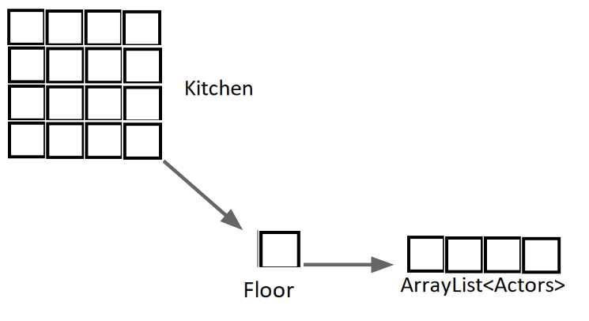
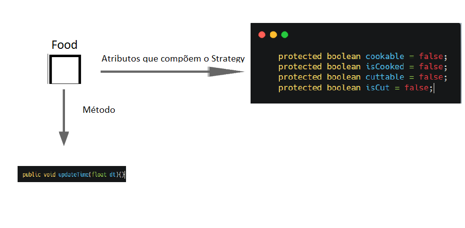
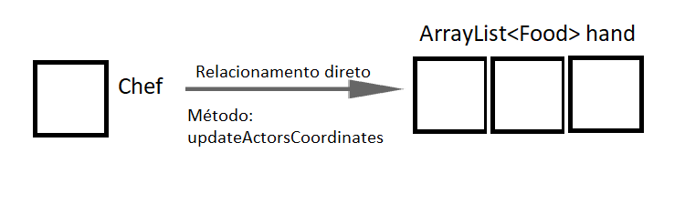
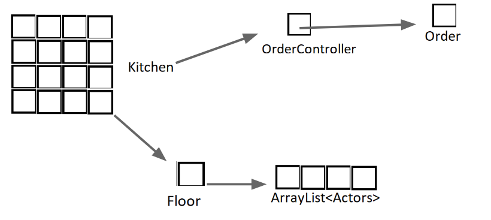
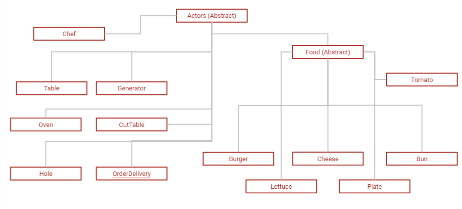
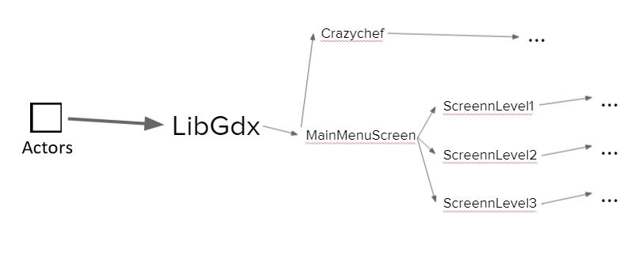

# Projeto `Crazychef`

# Descrição resumida do Projeto/Jogo

> * O jogo se baseia na montagem e entrega de pedidos de um restaurante.
> * O jogador controla o 'Chef', que pode se mover em 4 direções, pegar os ingredientes, soltar, cortar, cozinhar e entregar os pedidos.
> * Para o 'Chef' preparar os ingredientes basta soltá-los em sua respectiva 'Mesa de preparo' (Fogão ou Tábua de Corte).
> * Para pegar mais de um ingrediente é necessário estar carregando um prato.
> * Só se pode colocar no prato ingredientes preparados corretamente.
> * Os pedidos aparecem na parte superior da tela (máximo 3 pedidos simultâneos) e os ingredientes de cada um são gerados aleatóriamente. Quanto mais rápido o pedido for entregue, mais pontos o jogador ganha.
> * Ao lado dos pedidos, há a pontuação da fase e o tempo restante, caso o tempo acabe, a fase se encerra e os pontos totais aparecem para o jogador.
> * Comandos:
>  * Mover: `Setas direcionais`
>  * Pegar: `Barra de Espaço`
>  * Soltar: `D`
>  * Pausar: `Esc`

> ### Obs: O jogo foi feito para a resolução 1280x720, no geral tudo funciona em diferentes resoluções, porém há distorções e os botões do menu principal podem não funcionar corretamente (Tente sempre clicar no meio do botão). 

# Equipe - `F0rJava`
* `Giovanni Machado Quintella Gama` - `247122`
* `João Víctor dos Santos Oliveira` - `199815`

# Arquivo Executável do Jogo

> * [Download](https://github.com/F0rJava/MC322-Colab/raw/main/Crazychef/Crazychef.jar)
 
# Slides do Projeto

## Slides da Prévia
> * [Link](assets/Crazychef.pdf)

## Slides da Apresentação Final
> * [Link](https://docs.google.com/presentation/d/149JKsbZuESQA_N5AeuSi4SHDt1VzXNynNk-ZeZFEMjE/edit#slide=id.g1202abbc024_0_0)

## Relatório de Evolução
> Durante parte do desenvolvimento do projeto, a arquitetura inicial proposta demonstrou satisfazer as necessidades para o funcionamento adequado do jogo. A primeira mudança esteve relacionada ao framework utilizado. Como o LibGDX trabalha com “Screens”, classes que são responsáveis por renderizar objetos na interface gráfica, cada fase do nosso jogo, menus principal e de pause e tela final precisaram ser “envelopados” por classes de “Screens”.
Outra mudança esteve relacionada com a adição da geração de pedidos, fazendo-se necessário adicionar um novo componente à estrutura original, o ‘controlador de pedidos’. A princípio, os pedidos seriam controlados pelo Controller geral (que movimenta o ‘Chef’, pausa o jogo, muda as telas), porém essa classe já estava com uma complexidade muito elevada. 
Pensamos, então, em criar o ‘controlador de pedidos’, que seria instanciado juntamente com cada tela do jogo (não há necessidade de controlar pedidos no menu principal, e cada fase pode possuir diferentes ingredientes, tempo de pedidos, tempo de geração de pedidos, entre outros). Além de controlar os pedidos, essa classe também registra a pontuação obtida pela entrega de cada um deles.

# Destaques de Código

~~~java
public class Chef extends Actors{
    private boolean[] orientation;
    private Texture chefFront;
    private Texture chefBack;
    private Texture chefLeft;
    private Texture chefRight;
    ...

    //orientation é um vetor de 4 posições, onde a posição 0 indica que o chef está virado pra frente, 1 para trás, 
      2 para esquerda e 3 para a direita, com cada movimento esse textura é atualizada e indicada para a impressão na tela.

    public Texture getTexture(){
        if(orientation[0])
            return chefFront;
        else if(orientation[1])
            return chefBack;
        else if(orientation[2])
            return chefLeft;
        else
            return chefRight;
    }
}
~~~ 

# Destaques de Orientação a Objetos
> Kitchen matriz de Floor, Floor ArrayList de Actors (Polimorfismo).

## Diagrama de Classes usada no destaque OO:
> 

## Código do destaque OO:

~~~java
public class Kitchen{
   private Floor[][] floors;
   ...
}

public class Floor {
   private ArrayList<Actors> actors;
   ...
}

public class Actors extends Rectangle{
   private Rectabgle actor;
   ...
}

~~~

# Destaques de Patterns:
> * Foi utilizado o pattern Strategy nas comidas, onde herdeiras diferentes da classe Food possam ser "cortáveis", "cozinháveis" ou nenhum dos dois.
> * Também foi utilizado o pattern Observer, onde o chef tem um "relacionamento" direto com as Food presentes em sua mão, pois em cada movimento ou ação do chef as texturas e posições das comidas na matriz Kitchen podem mudar.

## Diagrama do Pattern:
> * Strategy:
> 
> * Observerver:
> 

## Código do Pattern:
> * Strategy:
~~~java
//Classe abstrata
public abstract class Food extends Actors{
   protected boolean cockable = false;
   protected boolean isCooked = false;
   protected boolean cuttable = false;
   protected boolean isCut = false;
   ...
   public void updateTime(float dt){}
}

//Exemplo de comida cortável
public class Lettuce extends Food{
   private Integer timetoCut;
   private float timeCount;
   ...
   public void updateTime(float dt){
      timeCount += dt;
      if(timeToCut>0){
         ...
      }
      if(timeToCut == 0){
         ...
      }
   }
}

//Exemplo de comida cozinhável
public class Burger extends Food{
   private Integer timeUntilCooked;
   private Integer timeToBurn;
   private float timeCount;
   ...
   public void updateTime(float dt){
      timeCount += dt;
      if(timeUntilCooked > 0){
         ...
      }
      if(timeUntilCooked == 0 && timeToBurn == 0){
         ...
      }
      else if(timeUntilCooked == 0){
         ...
      }
      if(timeToBurn > 0){
         ...
      }
   }
}
~~~
> O pattern 'Strategy' foi utilizado com o intuito de não engessar o código na adição de novos ingredientes. Ao herdar a classe 'Food', os ingredientes podem possuir diferentes atributos: podem ser cortáveis, cozinháveis, ambos, entre outras ações que podem ser adicionadas.

> * Observer:
~~~java
public class Chef extends Actors{
   private Plate plate;
   private ArrayList<Food> hand;
   ...
   public void updateActorsCoordinates(){
      for(int i = 0; i < hand.size(); i++){
         hand.get(i).setX(this.x);
         hand.get(i).setY(this.y);
         if(orientation[0])
            hand.get(i).setOrientation(0, 10);
         else if(orientation[1])
            hand.get(i).setOrientation(0, 0);
         else if(orientation[2])
            hand.get(i).setOrientation(-20,20);
         else if(orientation[3])
            hand.get(i).setOrientation(20,20);
      }
   }
}
~~~

> O pattern 'Observer' foi adotado na movimentação do 'Chef', em que toda vez que ele muda sua orientação e posição os 'Actors' que estão em sua mão (hand) são informados dessa alteração, alterando também a sua própria posição.

# Conclusões e Trabalhos Futuros
> Com a realização do projeto, podemos perceber o quão impactante é a determinação de uma arquitetura bem-feita e coesa antes do início do desenvolvimento. Apesar da nossa arquitetura ter suprido a necessidade até certo ponto, a adição de funções que, não havíamos determinado como seriam feitas previamente, ocasionou em problemas de referência aos objetos (uso de ‘casting’ em alguns momentos).
	Dentre os design patterns que não puderam ser implementados a tempo, temos o “factory”, que poderia ser uma classe construtora de fases, não necessitando que a instanciação e posicionamento de cada objeto fosse feito dentro da classe de fase. 
	Apesar de alguns problemas de arquitetura, acreditamos que se realizarmos as correções necessárias e adicionarmos os desgin patterns citados, nosso projeto possui grande potencial de escalabilidade, pois é simples de alterar a posição dos objetos no mapa, alterar tempo de fase, tempo de pedidos, pontuação, implementar novos ingredientes, entre outros.

# Diagramas

## Diagrama Geral da Arquitetura do Jogo

> 
> 
> 
